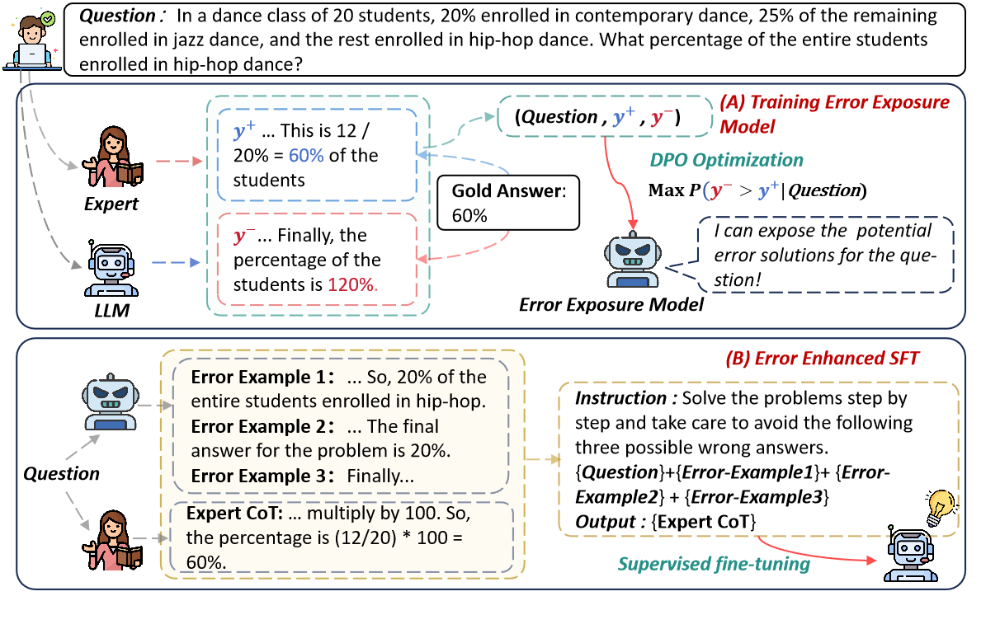

# EULER: Enhancing the Reasoning Ability of Large Language Models through Error-Induced Learning

This repository contains the source code for the paper: [EULER: Enhancing the Reasoning Ability of Large Language Models through Error-Induced Learning]().

[](https://github.com/NEUIR/EULER/edit/main/README.md)
[](https://arxiv.org/pdf/xxxx.xxxxx)
[](https://huggingface.co/papers/xxxx.xxxxx)
[](https://huggingface.co/qizheyanger/EULER)

<div align="center">
<p align="center" dir="auto">

• 🎯 [Overview](#overview) 
• ⚙️ [Requirements](#requirements)
• 🔧 [Reproduction Guide](#reproduction-guide)
</p>
<p align="center" dir="auto">

• ✈️ [Experimental Result](#experimental-result) 
• 📃 [Acknowledgement](#acknowledgement) 
• 📝 [Citation](#citation)
• 📨 [Contact](#contact)
</p>
</div>


## Overview

EULER is an innovative framework designed to enhance the mathematical reasoning capabilities of Large Language Models (LLMs) by strategically optimizing the generation and utilization of solution errors. At its core, EULER introduces a novel error exposure model that increases the likelihood of generating self-made solution errors while leveraging high-quality solutions from a superior LLM to regularize the overall generation quality.





## Requirements

### 1. Python Environment:

Install the following packages using Pip or Conda under this environment.

```
python >= 3.8
torch == 1.12.1
recbole == 1.2.0
datasets == 3.1.0
transformers == 4.22.2
sentencepiece == 0.2.0
faiss-cpu == 1.8.0.post1
scikit-learn >= 1.1.2
numpy >= 1.17.2
pandas >= 1.0.0
tqdm
jsonlines
networkx
```
### 2. Install LLaMA-Factory.
Refer to [https://github.com/hiyouga/LLaMA-Factory](https://github.com/hiyouga/LLaMA-Factory) for detailed instructions.

```bash
git clone --depth 1 https://github.com/hiyouga/LLaMA-Factory.git
cd LLaMA-Factory
pip install -e ".[torch,metrics]"
```

## Data-Collection

```bash
bash scripts/Data-Collection.sh 
```

## Train

### 1. Dpo-Optimization

```bash
bash scripts/dpo.sh
```

### 2. Error-Enhanced-SFT

```bash
bash scripts/error-enhanced-sft.sh 
```

## Inference

```bash
bash scripts/inference.sh 
```

## Eval
```bash
bash scripts/eval.sh 
```
